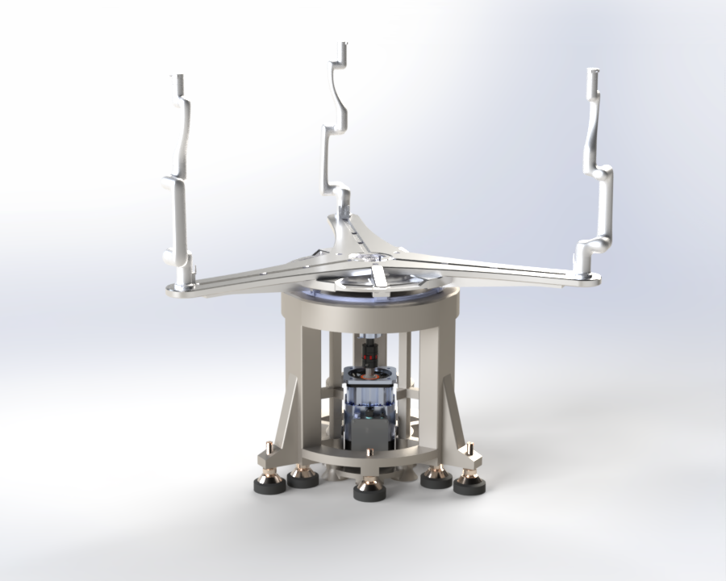
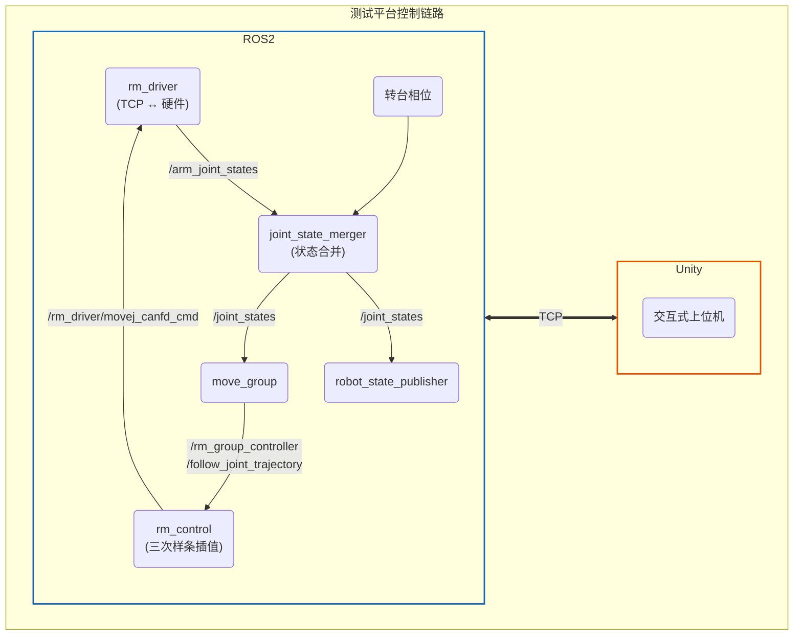

# Flapping Platform - 扑翼机实验平台

基于 ROS2 Humble 的扑翼机自动化实验平台。通过 RM63 机械臂搭载扑翼机模型在转台上进行扑翼飞行数据采集与运动控制实验。



## 系统架构



## 硬件组成

- **RM63 机械臂**：6 自由度协作机械臂，末端搭载扑翼机模型
- **转台**：提供绕 Z 轴旋转自由度，配合机械臂实现 7 轴运动
- **传感器接口**：包括但不限于MPU，网口设备等

## 软件包结构

| 包名 | 说明 |
|------|------|
| `flapping_platform_description` | URDF/XACRO 机器人模型描述，含仿真和真实硬件两个版本 |
| `flapping_platform_gazebo` | Gazebo 仿真环境、世界文件和模型 |
| `flapping_platform_moveit_config` | MoveIt2 运动规划配置，支持 Gazebo 仿真和真实硬件 |
| `flapping_platform_bringup` | 系统集合启动 |
| `flapping_platform_sensor_interface` | 传感器接口节点 |
| `flapping_platform_system_tests` | 系统集成测试 |
| `flapping_platform_ros2` | 元包，聚合以上所有子包 |
| `experiment` | 实验数据采集 |
### 外部依赖

| 包名 | 说明 |
|------|------|
| `ros2_rm_robot-humble` | RM 系列机械臂 ROS2 驱动（含 rm_driver、rm_control、rm_description 等） |
| `ROS-TCP-Endpoint` | Unity ↔ ROS2 的 TCP 通信桥接 |
## 环境要求


## 快速开始

### 1. 下载项目

```bash
mkdir -p ~/flapping_platform_ws/src
cd ~/flapping_platform_ws/src
git clone <this-repo-url> .
```

> 项目包含以下目录：`flapping_platform/`（核心包）、`ros2_rm_robot-humble/`（睿尔曼驱动）、`ROS-TCP-Endpoint/`（Unity 桥接）、`experiment/`（实验采集）。

### 2. 睿尔曼功能包依赖

参考 [睿尔曼 ROS2 开发文档](https://develop.realman-robotics.com/robot/ros2/getStarted/)

```bash
# 安装 ROS2 Humble（使用睿尔曼官方脚本）
cd ~/flapping_platform_ws/src/ros2_rm_robot-humble/rm_install/scripts/
sudo bash ros2_install.sh

# 安装 MoveIt2
cd ~/flapping_platform_ws/src/ros2_rm_robot-humble/rm_install/scripts/
sudo bash moveit2_install.sh

# 配置睿尔曼驱动库
cd ~/flapping_platform_ws/src/ros2_rm_robot-humble/rm_driver/lib/
sudo bash lib_install.sh
```

> 不想使用脚本安装可参考 [ROS2 Humble 官方文档](https://docs.ros.org/en/humble/Installation/Ubuntu-Install-Debians.html) 和 [MoveIt2 安装指南](https://moveit.ros.org/install-moveit2/binary/)。

### 3. Flapping Platform 依赖

```bash
# Gazebo Ignition Fortress（仿真环境）
sudo apt install gz-sim7

# Python 依赖
pip install pyserial
```

### 4. ROS-TCP-Endpoint 安装

```bash
cd ~/flapping_platform_ws/src/ROS-TCP-Endpoint
pip install -r requirements.txt
```

### 5. 编译

```bash
cd ~/flapping_platform_ws

# 安装所有 rosdep 依赖
rosdep install --from-paths src --ignore-src -r -y

# 先编译 rm_ros_interfaces（其他包依赖其自定义消息）
colcon build --symlink-install --packages-select rm_ros_interfaces
source install/setup.bash

# 编译全部包
colcon build --symlink-install
source install/setup.bash
```

> 也可按需分步编译：`colcon build --symlink-install --packages-select <package_name>`。

## 功能运行

### 1. gazebo环境运行

```bash
# 启动 Gazebo 仿真 + MoveIt2
ros2 launch flapping_platform_moveit_config gazebo_moveit.launch.py

# 启动转台速度控制 GUI
ros2 run flapping_platform_bringup turntable_control.py

# 运行笛卡尔直线往复运动 Demo
ros2 run flapping_platform_moveit_config vertical_move_demo \
  --ros-args -p start_x:=-0.4 -p start_y:=0.0 -p start_z:=0.3 -p target_z:=0.7 -p num_cycles:=5
```

### 2. mock环境运行

```bash
# 一键启动mock机械臂控制链路
ros2 launch flapping_platform_moveit_config mock_moveit.launch.py

```

### 3. 真实硬件运行

```bash
# 一键启动真实机械臂控制链路
ros2 launch flapping_platform_bringup flapping_platform_bringup.launch.py

```
### 4. ROS2 <==TCP==> unity

```bash
# 启动ROS2与unity的TCP通信（自定义ROS_IP）
ros2 run ros_tcp_endpoint default_server_endpoint --ros-args -p ROS_IP:=0.0.0.0 

```

## 仿真 vs 真实硬件

| 启动文件 | 用途 |
|----------|------|
| `flapping_platform_description/launch/robot_state_publisher_gazebo.launch.py` | Gazebo 仿真用 robot_state_publisher |
| `flapping_platform_description/launch/robot_state_publisher_real.launch.py` | 真实硬件用 robot_state_publisher |
| `flapping_platform_moveit_config/launch/gazebo_moveit.launch.py` | 仿真环境 MoveIt 启动 |
| `flapping_platform_moveit_config/launch/mock_moveit.launch.py` | 无硬件 Mock 测试 |
| `flapping_platform_moveit_config/launch/real_moveit.launch.py` | 真实硬件 MoveIt 启动 |

## 目录结构

```
flapping_platform_ws/
├── src/
│   ├── flapping_platform/               # 扑翼机平台核心包
│   │   ├── flapping_platform_bringup/         # 系统启动
│   │   ├── flapping_platform_description/     # URDF 模型
│   │   │   └── urdf/robots/                   #   - gazebo / real 两个版本
│   │   ├── flapping_platform_gazebo/          # Gazebo 仿真
│   │   ├── flapping_platform_moveit_config/   # MoveIt2 配置
│   │   │   ├── config/real/                   #   真实硬件参数
│   │   │   ├── config/gazebo/                 #   仿真参数
│   │   ├── flapping_platform_ros2/            # 元包
│   │   ├── flapping_platform_sensor_interface/# 传感器接口
│   │   └── flapping_platform_system_tests/    # 系统测试
│   ├── ros2_rm_robot-humble/             # RM 机械臂驱动（外部依赖）
│   ├── ROS-TCP-Endpoint/                 # Unity TCP 桥接（外部依赖）
│   └── experiment/                       # 实验采集与控制
│       ├── src/                          #   - force_collector.cpp
│       │                                 #   - experiment_control.cpp
│       ├── scripts/                      #   - force_visualizer.py
│       │                                 #   - experiment_gui.py
│       └── launch/                       #   实验启动文件
├── build/     # colcon 编译产物
├── install/   # colcon 安装产物
└── log/       # 运行日志
```
